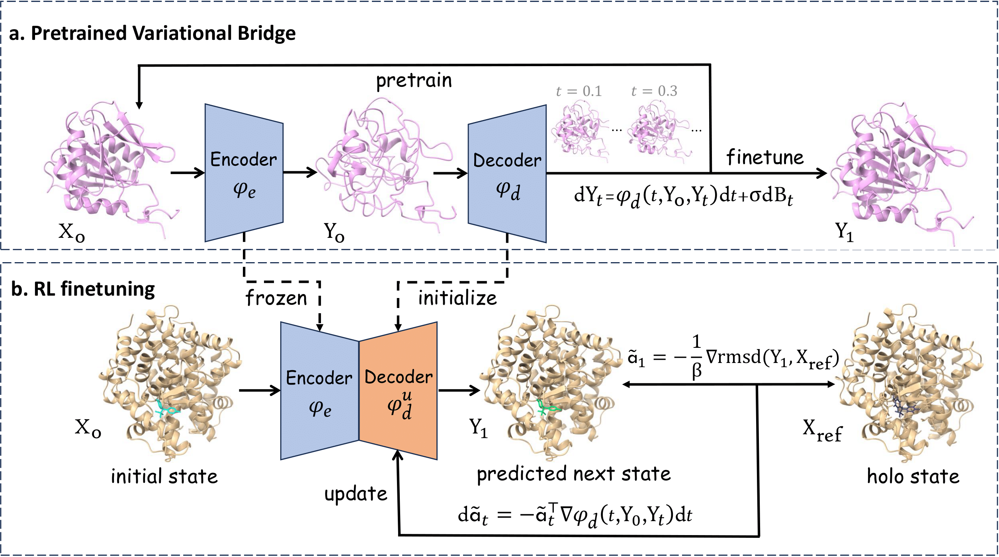

# Unified Biomolecular Trajectory Generation via Pretrained Variational Bridge



## 🧬 Introduction

This is the official repository for our paper "Unified Biomolecular Trajectory Generation via Pretrained Variational Bridge" published in ICLR 2026. Due to the scarcity of publicly available MD trajectory data, existing deep learning models for time-coarsened dynamics that trained soly on such data exhibit limited generalization to unseen systems and generate conformations with suboptimal physical plausibility, particularly for large biomolecules such as proteins. To address this limitation, we propose the Pretrained Variational Bridge (PVB) model. PVB supports pretraining on abundant single-structure data and subsequent finetuning on limited paired trajectory data under a unified training objective, enabling full exploitation of structural knowledge across both training stages. In parallel, we integrate adjoint matching into our framework, which unlocks the potential of PVB for post-optimization of protein-ligand docking poses within short generated trajectories. We hope that this work will advance deep learning for fast and reliable MD simulations, while also extending its application to real-world scenarios.

## 🚀 Setup

### Dependencies

We provide conda dependencies for `cuda>=12.0`. You can directly create and activate a new conda environment by:
```
mamba env create -f env.yaml
conda activate dev
```

### Datasets

Due to privacy and licensing restrictions, we do not explicitly provide the raw training data here. Instead, we offer the pre-processing scripts for each dataset in the `data` folder, named as `{dataset_name}_dataset.py`. Please refer to these scripts if you wish to pretrain from scratch or train on your own data.

Furthermore, the raw test data for ATLAS, mdCATH, MISATO, and PDBBind, which were used in our evaluation, have been published on [Zenodo](https://doi.org/10.5281/zenodo.18428059). Please download the data to your server before running the evaluation scripts.

Below is a brief overview of the contents of these datasets. Each dataset is stored in a folder named accordingly, which contains the following files:

- `raw/`: the directory that contains raw test data, including the initial state for MD simulations `*.pdb`, the reference MD trajectories (as well as replicas if provided) `*.xtc`. NOTE THAT hydrogens have been removed from the topology and trajectory files.
- `test.jsonl`: the indexing file for the test set, where each line contains basic information for one test system.
- `{train/valid}.{txt/csv}`: the training and validation splits for each dataset.


### Model Weights

For reproducibility, we have uploaded the model weights at [Google Drive](https://drive.google.com/drive/folders/1wUWCuLUnIzvif2BhB9XUXTP-C9F0flEJ?usp=sharing). You can download them for evaluation.

## 👀 Usage

### Training

‼️ Before running training scripts, please make sure all datasets are well prepared following our instructions.

We provide the training script in `train.sh`, which can be executed by running:

```bash
GPU=0,1,2,3 bash train.sh
```

The settings for distinguishing pretraining and finetuning, as well as all other training hyperparameters, can be adjusted in `config/train.yaml`. Below is a brief overview:

```yaml
data:
  dataset: uni                # default dataset type, DO NOT CHANGE
  same_origin: false          # whether the selected data in a mini-batch are of the same molecule, DO NOT CHANGE
  complexity: "n"             # pre-defined computational complexity w.r.t. the number of atoms
  ubound_per_batch: 2_000     # upper bound of the complexity of each mini-batch, depends on CUDA memory
  max_batches: 60_000         # upper bound of mini-batches in an epoch for each dataset
  path:
    ### pretrain
    ### NOTE THAT raw data of each dataset should be first pre-processed by `data/{dataset_name}_dataset.py`, which yields `train_block` and `valid_block` directories
    pdb_train: dataset/PDB/train_block  # training split of the dataset
    pdb_valid: dataset/PDB/valid_block  # validation split of the dataset
    ### md
    # mdcath_train: dataset/mdCATH/train_block
    # mdcath_valid: dataset/mdCATH/val_block

training:
  lr: 0.0001                            # learning rate
  loss_type: null                       # default: null, DO NOT CHANGE
  warmup: 1_000                         # warm-up steps
  max_epoch: 200                        # maximum training epochs
  grad_clip: 1.0                        # gradient clip, default: 1.0
  batch_size: 4                         # batch size, NOTE THAT you should only specify batch_size=number of GPUs, since mini-batches will be wrapped to one single batch before sending to DataLoader
  patience: 8                           # patience for early stop, based on validation loss
  save_topk: 10                         # number of saved checkpoints
  shuffle: true                         # whether to shuffle batches during each epoch
  num_workers: 8                        # number of CPU workers, default: 8
  save_dir: ckpt/pretrain               # directories for saving checkpoints
  wrapper:
    ema:
      update_after_step: 1_000_000      # the training step at which EMA is applied, default: 1_000_000

model:
  ref: null                             # specify the reference model checkpoint, ONLY FOR adjoint matching
  ckpt: null                            # specify the checkpoint to be loaded, default: null (training from scratch)
  model_type: md                        # specify the training stages: pretraining ('pretrain'), fine-tuning on paired trajectory data ('md'), and adjoint matching ('adj')
  hidden_dim: 256                       # hidden dimensions, default: 256
  ffn_dim: 512                          # FFN dimensions, default: 512
  rbf_dim: 32                           # RBF dimensions, default: 32
  heads: 8                              # the number of attention heads, default: 8
  layers: 8                             # the number of decoder layers, default: 8
  cutoff_lower: 0.0                     # lower bound of RBF cutoff, default: 0.0 Angstrom
  cutoff_upper: 10.0                    # upper bound of RBF cutoff, default: 10.0 Angstrom
  cutoff_H: 3.5                         # NOT USED
  k_neighbors: 32                       # the number of neighbors for KNN graph construction, default: 32
  coord_prior_var: 0.5                  # variational noise scale, default: sqrt(0.5)
  sigma: 0.2                            # SDE noise scale, default: 0.2
  additional_noise_scale: 0.2           # perturbation strength, default: 0.2
  kl_weight: 0.8                        # KL loss weight, default: 0.8
  re_weight: 1.0                        # ABM loss weight, default: 1.0
  reward_weight: 100.0                  # reward weight for adjoint matching, default: 100
  rl_sde_step: 10                       # discrete SDE step for adjoint matching, default: 10
  using_ode: false                      # whether to use ODE to model the bridge, default: false
  backbone: torchmdnet                  # backbone module type, default: torchmdnet, DO NOT CHANGE
```

### Inference

We mainly provide two inference scripts, `infer_prot.py` and `infer_complex.py`, for protein-ligand complexes (*e.g.*, PDBBind, MISATO) and protein monomers (*e.g.*, ATLAS, mdCATH), reppectively.

For proten monomers, the following command performs forward simulations with trajectories saved in the format of `.xtc`:
```bash
python infer_prot.py --config config/infer.yaml
```

Similarly, for protein-ligand complexes, please run:
```bash
python infer_complex.py --config config/infer.yaml
```

We introduce the parameters in the configuration file `infer.yaml`:
```yaml
dataset: protein                        # specify the data type: protein monomers ("protein"), MISATO ("misato"), PDBBind ("pdbbind")
name: none                              # specify an id for the test system if mode == "single", otherwise the parameter is not used
mode: all                               # "all": generate trajectories for multiple cases, "single": one test case
test_set: dataset/ATLAS/test.jsonl      # specify the indexing file (.jsonl) path for the test set if mode == "all", otherwise specify the PDB file path (.pdb) as the initial state
ckpt: /path/to/ckpt/pvb_atlas.ckpt      # checkpoint path
refiner: null                           # NOT USED in our experiment
save_dir: null                          # if null, save trajectories to the same directory as ckpt
inf_step: 1000                          # trajectory rollouts, default: 1000
sde_step: 10                            # discrete SDE steps, default: 10
batch_size: 1                           # number of trajectories in parallel, default: 1
gpu: 0                                  # GPU index, -1 for CPU only
```

### Evaluation

For convenience, we have provided the script `eval_all.py` for evaluation on different test sets. Please run:
```bash
python eval_all.py --config config/eval.yaml
```

The configuration file `eval.yaml` should contain following parameters:

```yaml
data_type: protein                        # specify the data type: protein monomers ("protein"), MISATO ("misato"), PDBBind ("pdbbind")
test_set: dataset/ATLAS/test.jsonl        # specify the indexing file (.jsonl) path for the test set
gen_dir: /path/to/results                 # path to the directory where generated trajectories are saved
lagtime: 10                               # lag time for TICA, default: 10 (100 ps) for ATLAS, 1 (1 ns) for mdCATH
reduced: true                             # whether to use reduced TICA features (only backbone torsions), specify true for ATLAS and false for mdCATH
use_distances: true                       # whether to use distances of contacting heavy atom pairs as TICA features, which is mutually exclusive with the `reduced` parameter. default: true
### the following parameters are used to distinguish different inference settings
sde_step: 10                              # discrete SDE step for inference
inf_step: 1000                            # trajectory rollouts
```

## 💡 Contact

Please feel free to contact us by creating issues in the github repo or sending emails to yu-zy24@mails.tsinghua.edu.cn for any concerns about our project. We thank you for your interest in our work and your contribution to making it better!

## Reference

```
@inproceedings{
  yu2026unified,
  title={Unified Biomolecular Trajectory Generation via Pretrained Variational Bridge},
  author={Yu, Ziyang and Huang, Wenbing and Liu, Yang},
  booktitle={The Fourteenth International Conference on Learning Representations},
  year={2026}
}
```

## License

MIT